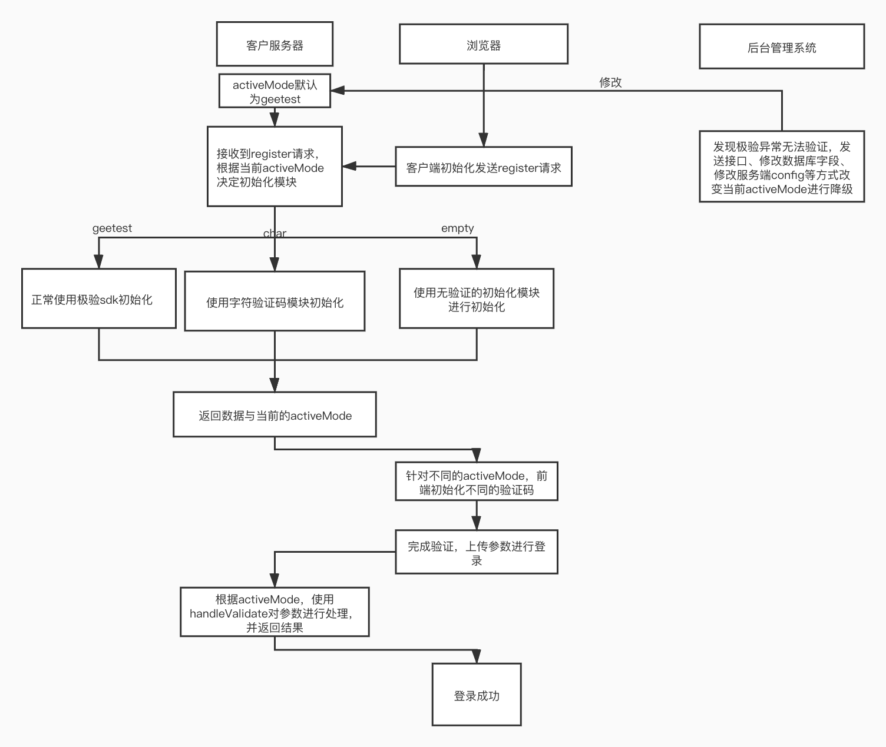

###  验证码模式切换demo

### 背景

在极验服务器出现异常时，为了保障业务稳定性，需要对验证码服务进行降级。除了极验自身的宕机模式，本demo还提供了字符验证与无验证的降级方式，
三种模式任意切换，完全解除验证服务的耦合。

### 流程

核心：在用户后端服务内建立一个唯一的activeMode标识，这个activeMode可以放在数据库、配置文件、内存等地方。每次用户进行注册或者验证的过程中，都会先判断当前的activeMode类型,
,然后做出不同验证模式的处理。发现某种验证形式出现问题后，便可通过修改数据库或者接口等其它方式将activeMode修改。

### 运行

1.安装依赖
npm i 

2.启动项目
npm run start

3.访问
public 目录下有2个页面
demo页面： http://localhost:3000/click-float.html
管理页面：http://localhost:3000/management.html
